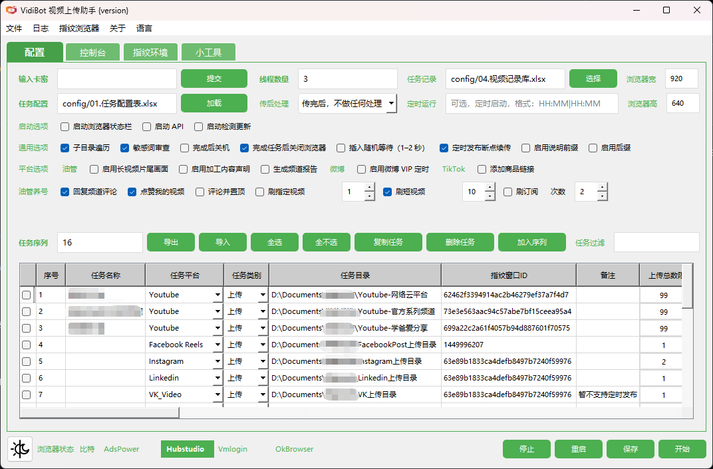
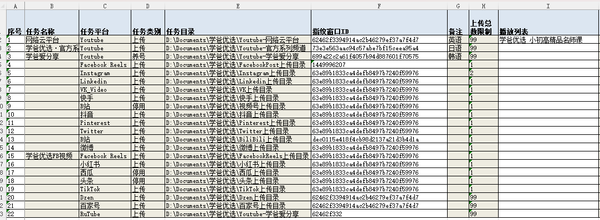
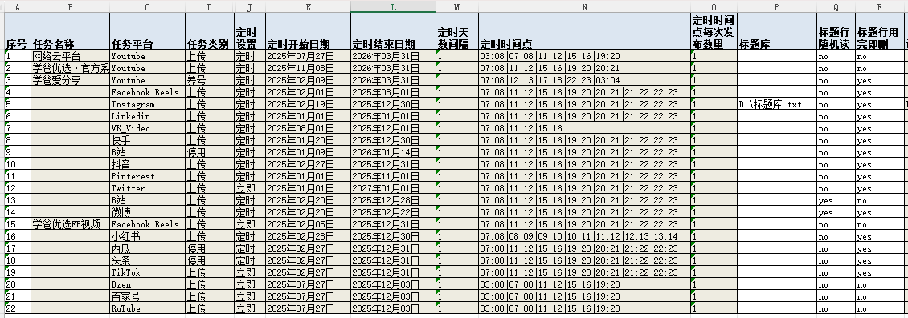
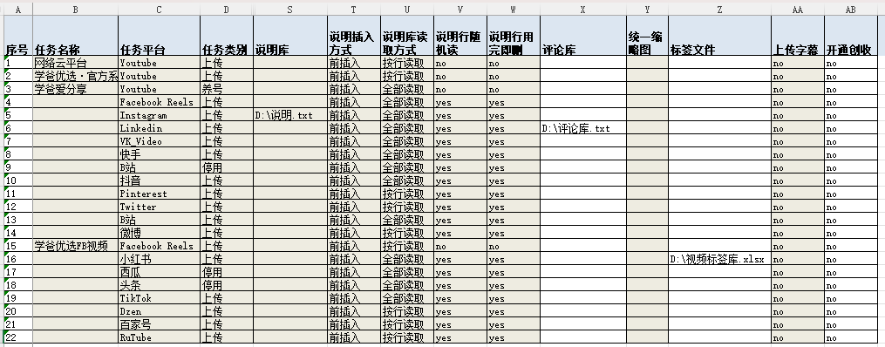
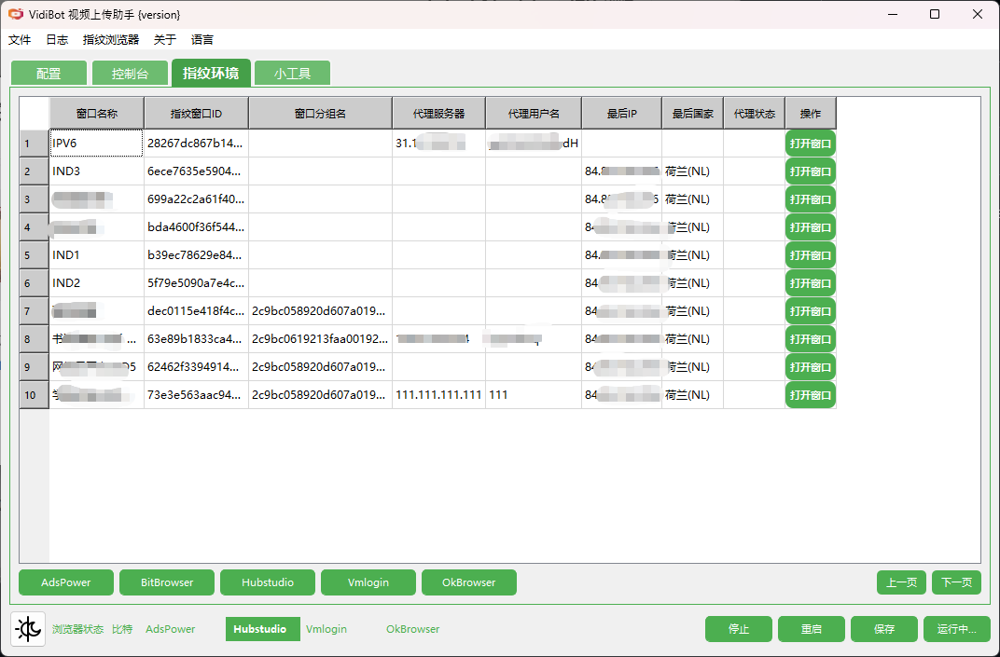
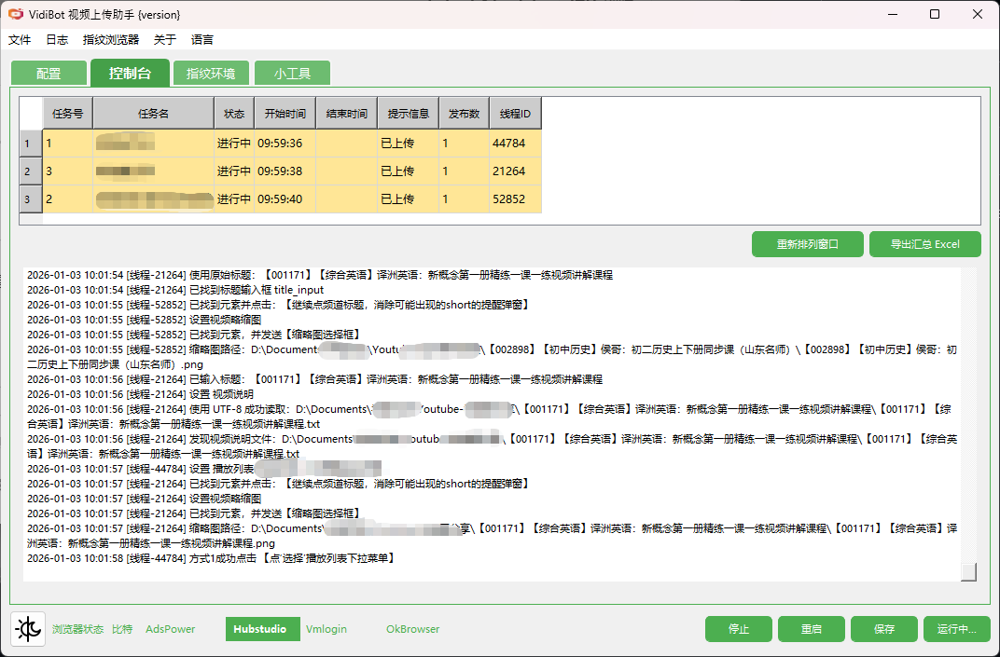

  

  
  
  
  
  
  

# VidiBot — 多平台视频自动化上传与批量发布工具

> **专业的视频平台自动化发布系统**  
> 一次配置，多平台稳定发布，面向内容创作者与团队的生产力工具

---

## 🚀 项目简介

**VidiBot** 是一款面向 **个人创作者、内容工作室及企业团队** 的 **视频平台自动化发布工具**。  
它通过 **真实浏览器自动化 + 账号环境隔离** 的方式，稳定地将视频内容发布到多个国内外主流平台，**无需依赖官方 API**。

VidiBot 的设计目标不是“脚本工具”，而是一个 **长期可用、可规模化、可商业化使用的视频分发系统**。

本项目为 **闭源商业软件**，通过授权方式提供无限制的视频上传数量。
> 本 GitHub 仓库仅用于产品介绍与说明，不包含 VidiBot 的源代码或可运行核心逻辑。

---

## 🎯 适合谁使用？

VidiBot 特别适合以下场景：

- 🎥 **自媒体 / 内容创作者**  
  一次制作，多平台分发，显著减少重复操作时间
- 🧑‍🤝‍🧑 **内容工作室 / MCN 团队**  
  多账号、多平台并行发布，流程标准化
- 🏢 **企业 / 品牌方**  
  稳定运营官方账号矩阵，降低人工成本
- 🌍 **跨境 / 海外内容团队**  
  同时运营 YouTube、TikTok、Instagram 等国际平台

---

## 🧠 为什么选择 VidiBot

- 🚀 批量自动上传，节省大量人工操作时间  
- 🌍 支持多个国内外主流视频平台  
- 🔐 授权制闭源软件，可稳定长期使用  
- 🤖 模拟真实人工操作，更接近平台原生使用方式  
- 📊 支持多账号、多任务并行处理  

---

## ✨ 核心优势

### 1️⃣ 真·自动化发布（非 API）

- 通过 **指纹浏览器 + 自动化操作**，模拟真实人工发布流程  
- 不依赖平台 API，**不受接口限制、额度限制或政策变动影响**
- 更贴近真实用户行为，适合长期稳定使用

---

### 2️⃣ 多平台统一管理

一次配置，即可将视频发布到多个平台，包括但不限于：

- 🌍 **海外平台**：YouTube、TikTok、Instagram、Facebook、Twitter、LinkedIn、Pinterest、VK / Dzen  
- 🇨🇳 **国内平台**：抖音、哔哩哔哩、视频号、快手、微博、小红书  

支持 **短视频 / 长视频** 场景，满足不同平台规则。

---

### 3️⃣ 多账号 & 账号环境隔离

- 支持主流 **指纹浏览器环境**（如 BitBrowser、AdsPower、Hubstudio、VMLogin、OkBrowser）
- 每个账号独立浏览器指纹，避免账号关联风险
- 特别适合账号矩阵、团队协作与规模化运营

---

### 4️⃣ 发布流程高度可控

支持对每条视频进行精细化控制，包括：

- 标题 / 描述 / 标签  
- 缩略图（封面）  
- 字幕文件  
- 定时发布  
- 发布状态与日志记录  

让自动化不只是“能跑”，而是 **可控、可追踪、可复盘**。

---

### 5️⃣ 商业级稳定性设计

- 自动异常检测与重试机制  
- 发布过程日志完整记录  
- 持续适配平台 UI 变更  
- 已在真实生产环境中长期使用与迭代

---

## 🧠 设计理念

> **自动化 ≠ 脚本堆砌**

VidiBot 从一开始就不是“写几个自动化脚本”，而是围绕以下原则构建：

- ✅ 稳定优先：适合长期、持续运行  
- ✅ 真实行为：尽量接近人工操作  
- ✅ 可维护性：快速适配平台变化  
- ✅ 商业友好：支持授权、升级与服务  

---

## 📊 支持的平台（截至 2025 年 12 月）

| 平台 | 状态 |
|------|------|
| YouTube | ✔ |
| TikTok | ✔ |
| Instagram | ✔ |
| Twitter | ✔ |
| Pinterest | ✔ |
| Facebook（短 / 长视频） | ✔ |
| VK（短 / 长视频） | ✔ |
| LinkedIn | ✔ |
| 抖音 | ✔ |
| BiliBili | ✔ |
| 视频号 | ✔ |
| 快手 | ✔ |
| 微博 | ✔ |
| 小红书 | ✔ |

---

## 🧩 支持的指纹浏览器

| 浏览器 | 说明 |
|--------|------|
| Bitbrowser | 支持（免费用户可用） |
| AdsPower | 支持（需订阅） |
| Hubstudio | 支持（需订阅） |
| VMlogin | 支持（需订阅） |
| OkBrowser | 支持（需订阅） |

---

## 📥 下载方式

**最新版本：** V3.2.1（2025-12-20）  

**下载地址：**  
- Baidu Disk：https://pan.baidu.com/s/1mbP16-BbhAs4Vpo9q55x8g?pwd=dg4f
- Google Drive: https://drive.google.com/drive/folders/1PoH8PHtsCXuMR6aHojIl3zojBZ2ESUW6?usp=sharing

**运行环境：** Windows 10 / Windows 11（64 位）

> ⚠️ 提示：  
> 若未填写授权注册码，也可正常使用，默认进入 **免费模式**，功能完整，仅上传数量受限。

---

## 🔐 授权与使用说明（简要）

- 本项目为 **非开源软件**
- 提供 **免费模式**（功能完整，但存在使用限制）
- 提供 **授权模式**，解锁更高使用额度与完整能力
- 支持个人、团队及商业使用授权

> 详细授权方式请参考后续 LICENSE / 授权说明文档

---

## 📬 联系与支持

如果你：

- 想确认是否适合你的使用场景  
- 需要商业授权 / 团队使用  
- 有定制需求或平台适配需求  
📩 请联系：  
**邮箱：achille.hu@gmail.com**
（授权咨询优先回复）

---

## 🚀 快速上手

1. 下载并解压 VidiBot 程序包，无需任何编程基础，解压即可使用。
3. 配置指纹浏览器，新建指纹窗口，用这个窗口登录到视频平台后台
4. 把视频文件、缩略图、视频说明等放在同一个文件目录  
5. 打开VidiBot，新建一个上传任务，指定文件目录，并为之指定一个指纹窗口
6. （可选）设置定时发布时间  
7. 点击“开始”即可运行  

---

## 📸 演示截图 / 动图
> 以下截图均来自 VidiBot 实际运行界面。
### 主界面

### 批量任务列表

### 指纹窗口列表示例

### 运行状态与日志

